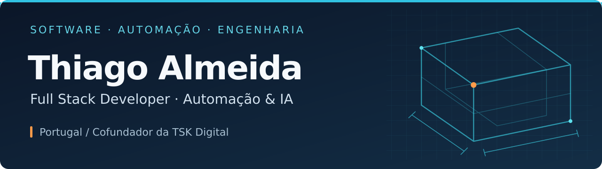
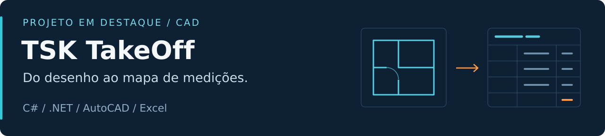
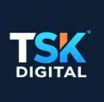

  

  <strong>Desenvolvo websites, aplicações e automações para simplificar o trabalho de empresas.</strong>

  <a href="https://tskdigital.pt"><strong>TSK Digital ↗</strong></a>
  &nbsp;&nbsp;·&nbsp;&nbsp;
  <a href="#projeto-em-destaque">Projeto em destaque</a>
  &nbsp;&nbsp;·&nbsp;&nbsp;
  <a href="#tecnologias">Tecnologias</a>
  &nbsp;&nbsp;·&nbsp;&nbsp;
  <a href="#english">English</a>

## Da experiência em obra ao desenvolvimento de software

Sou **Thiago Almeida**, desenvolvedor e cofundador da **TSK Digital**, em Portugal. Trabalho em aplicações web, integrações e agentes de atendimento com inteligência artificial.

Trago cerca de **18 anos de experiência em projetos de construção civil e telecomunicações**, com uma forte ligação ao AutoCAD e à preparação de obra. Essa experiência orienta a forma como desenvolvo: compreender o processo, organizar a informação e construir ferramentas úteis para quem as utiliza.

| Desenvolvimento web | Automação e IA | Engenharia e CAD |
| :--- | :--- | :--- |
| Websites, aplicações e painéis de gestão para negócios. | Agentes de atendimento, integrações e fluxos de trabalho. | Medições, quantitativos e ferramentas para desenhos técnicos. |
| **Next.js · TypeScript** | **n8n · Node.js · APIs** | **C# · Python · AutoCAD** |

## Projeto em destaque

### [TSK TakeOff](https://github.com/tsantos86/tskpluginmedicao)

Plugin para medir alvenarias, fachadas, áreas e elementos lineares no AutoCAD, organizar os resultados por artigo, serviço e piso e exportar o mapa de medições para Excel.

- **Medições rastreáveis:** identificação visual e registo dos dados no próprio DWG.
- **Vãos e descontos:** deteção de vãos com confirmação dos descontos aplicáveis.
- **Ligação ao Excel:** exportação XLSX e sincronização com Excel instalado.
- **Lógica testável:** projeto xUnit para cálculos independentes do AutoCAD.

**C# · .NET Framework 4.8 / .NET 8 · AutoCAD .NET API · ClosedXML · xUnit**

[Explorar código e documentação →](https://github.com/tsantos86/tskpluginmedicao) &nbsp;·&nbsp; [Consultar os testes →](https://github.com/tsantos86/tskpluginmedicao/tree/main/Tests)

## Tecnologias

  
  
  

  
  
  
  
  
  

| Área | Outras ferramentas que utilizo |
| :--- | :--- |
| Interface | Tailwind CSS, JavaScript |
| Dados e integrações | Redis, APIs REST |
| Infraestrutura | Docker, Linux, Vercel |
| CAD e desenvolvimento | AutoCAD, .NET |

## TSK Digital

Desenvolvimento web, automações e agentes de atendimento com IA para empresas. Parte do meu trabalho comercial é desenvolvida em repositórios privados.

**Tens um processo para simplificar ou um projeto para desenvolver?**

[Conhece os serviços e fala connosco →](https://tskdigital.pt)

---

## English

<strong>About me and my work</strong>

 

I'm **Thiago Almeida**, a developer based in Portugal and co-founder of **TSK Digital**. I build websites, business applications and workflow automations.

My background includes around **18 years in civil construction and telecom design**, with hands-on experience in AutoCAD and construction preparation. I bring that practical perspective to software development.

My featured public project, **[TSK TakeOff](https://github.com/tsantos86/tskpluginmedicao)**, is a C# plugin that connects CAD measurements with Excel quantity reports. It includes drawing-based measurement records, opening deductions, XLSX export and a separate calculation test project.

**Main tools:** C#, Python, TypeScript, Next.js, Node.js, Supabase, PostgreSQL, n8n and Docker.

[Visit TSK Digital →](https://tskdigital.pt)

